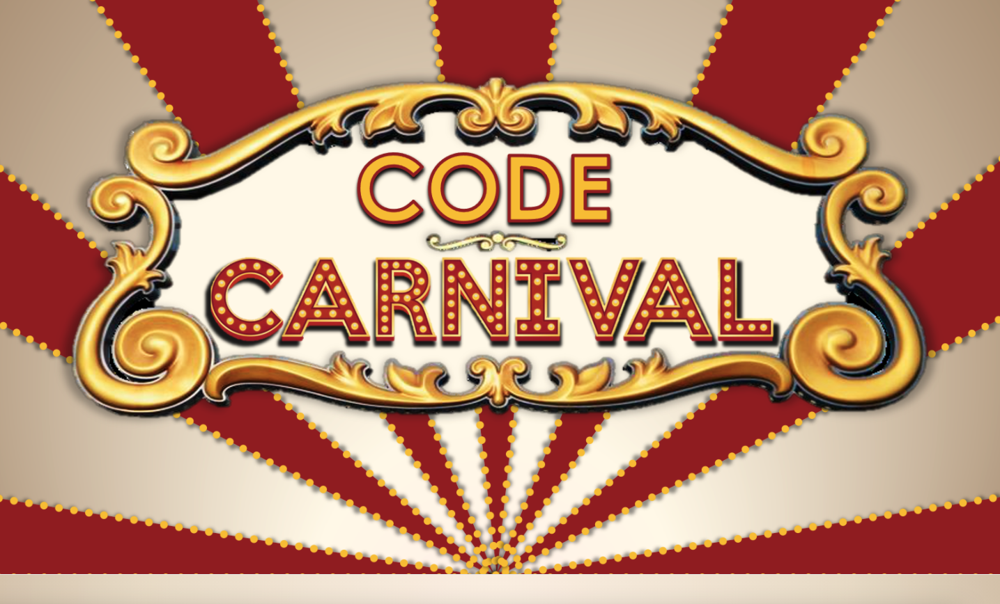
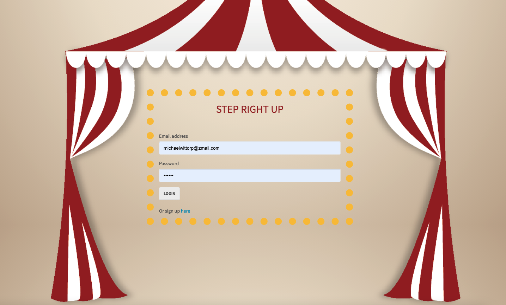
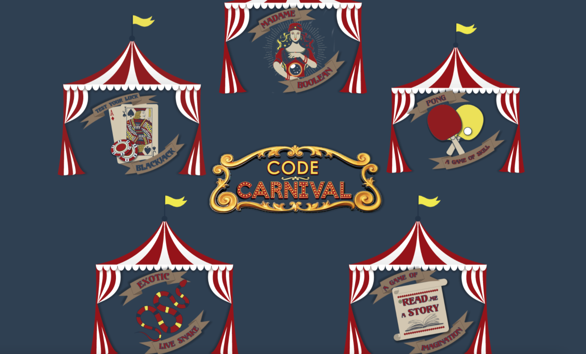
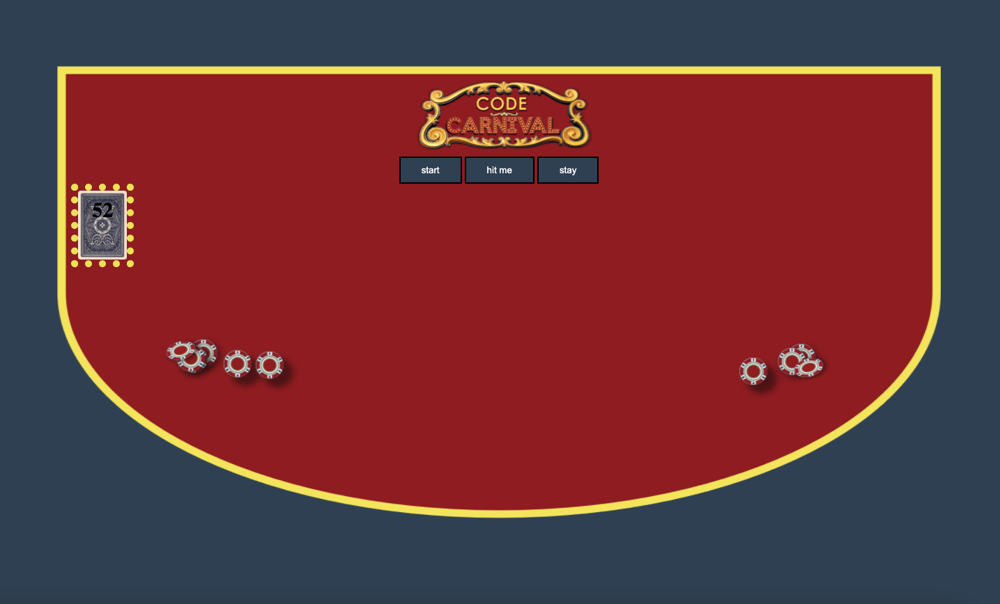

# Code-Carnival

Step right up! Ladies and gentlemen, boys and girls, near and far. Try your hand at the best code games around, at the most extraordinary carnival in the land, the Code Carnival!

## Project Details

Welcome to the Code Carnival!

The Code Carnival is an all-inclusive collection of carnival games, created for all to play, excite, and enjoy. We want you to be immersed in the carnival experience, with games such as pong, blackjack, and the fortune teller, Madame Boolean, all coded for your enjoyment. Extra games were added as well, to the likes of MadLibs, Snake, and more! In doing so, we made use of a database, express server, user authentification, encryption, and game development. We hope you love your time at the carnival.

Thanks for stopping in!

## Application

Code Carnival: https://code-carnival.herokuapp.com/

Welcome: 
Step Right Up: 

## Build Details

This application was developed using: MySql, JavaScript, Express, Passport, Sequelize, Phaser.io, and more!

## Repository & Preview

View the repository at: https://github.com/MichaelWitt/Code-Carnival

Preview: 
Demo: 

## Updates

You can find project updates in the repository, highlighting what was done to create the final product.

https://github.com/MichaelWitt/Code-Carnival/commits/

## Credits

UNC Coding Bootcamp And Trilogy for the inspiration.

Educative Snake Tutorial:
https://www.educative.io/blog/javascript-snake-game-tutorial

Pong Tutorial:
https://www.ansoriweb.com/2020/03/javascript-game.html

Thanks!

## Thanks For Visiting!

Come back soon :)
